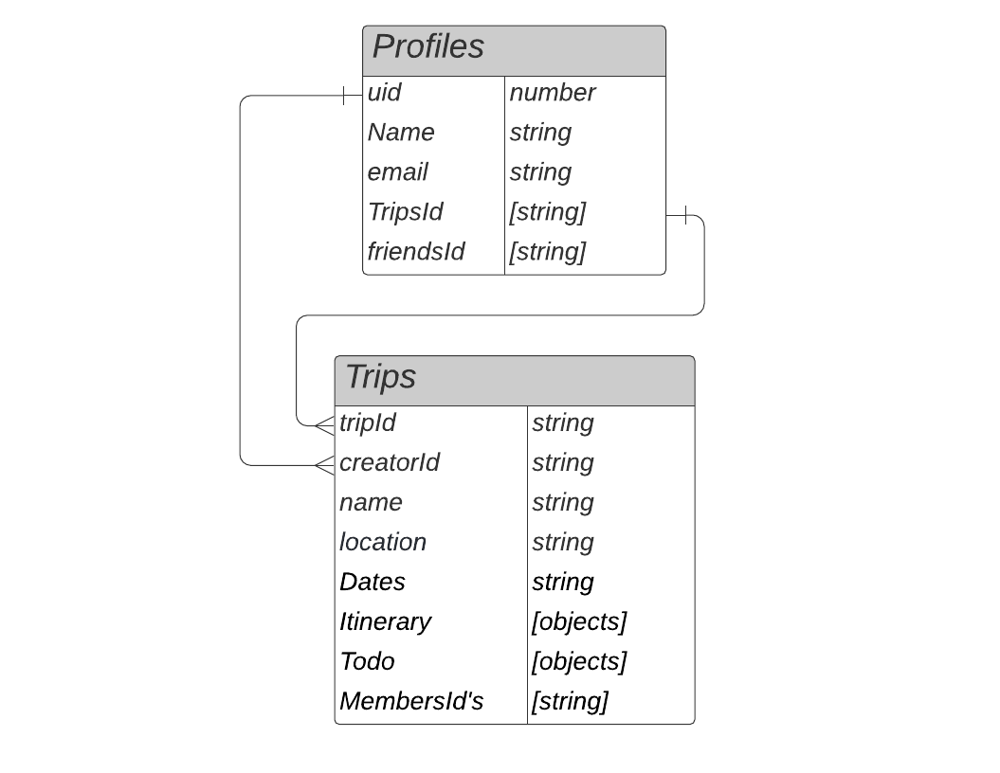

# Coordinate

### A React app that tracks all the details of a vacation
### By Shaun Kent

## Technologies Used

* HTML
* CSS
* Javascript
* React
* Firebase (firestore/authentication)
* MUI

## Description

Have you ever been on vacation/trip and wasted precious relaxation time due to miscommunication/misinformation? This app works to maximize your time by creating a centralized place where you can find all the necessary information about your trip and share it with others! Users can create groups and share items(Itinerary, to-do, flight info, etc.) to others in the group making sure everyone is up to date on the details, thus maximizing your relaxation time. 

## Component Diagram

.png)

## Database Structure

## Setup Firebase (firestore/authentication)

* (optional) Currently the application is connected to a development database in firestore. Follow instructions below to setup your own firebase.

* navigate to `https://firebase.google.com/`

* Click the `Get Started` button and create an account or sign in using one of the providers available.

* Once completed add a project and name it.

* Next register your app by selecting the web button `</>`

* Copy the firebaseConfig given by firebase. 

* Replace firebase config with your config in firebase.js file in services directory

* Initialize database by clicling `Firestore Database` then click `Get Started`. Setup firestore in production mode.

* Once created click the Rules tab and change the rules to `allow read, write: if true;`

* Initialize firebase authentication by clicking `Authentication` then click `Get Started`. Choose Email/Password then enable and save

* Firebase database and authentication should now be setup. You are ready to continue on the rest of setup.

## Setup/Instillation Requirements

* Go to this link: `https://github.com/SKona306/Coordinate`

* In the right hand corner click the green button that says `code`

* Copy the HTTPS link

* Open a command prompt and traverse to the directory you want the project stored in

* In command line enter `git clone [copied HTTPS link]`

* Open project in code editor of choice

* To install dependencies travel to the root directory then enter command `npm install`.

* To start app enter `npm start` in command line

* To exit live server press CTRL + `c`

## Known Bugs

* Background images load in slowly after component mounts; issue is likely that images are too large in size

## Features in the works

* Create functionality to add itinerary and todo items to trips collection in firestore

* Ability to add friends to friends array in users collection

* Ability to message friends using firestore cloud messaging

* Add weather component that calls OpenWeather API and displays a 7 day forecast

* Add flightTracker API to display real time flight info

* give itinerary and todo items ability to be disabled when time stamp has passed

## License 

[MIT](https://choosealicense.com/licenses/mit/)

## Contact Information

* shaunkent81@gmail.com
